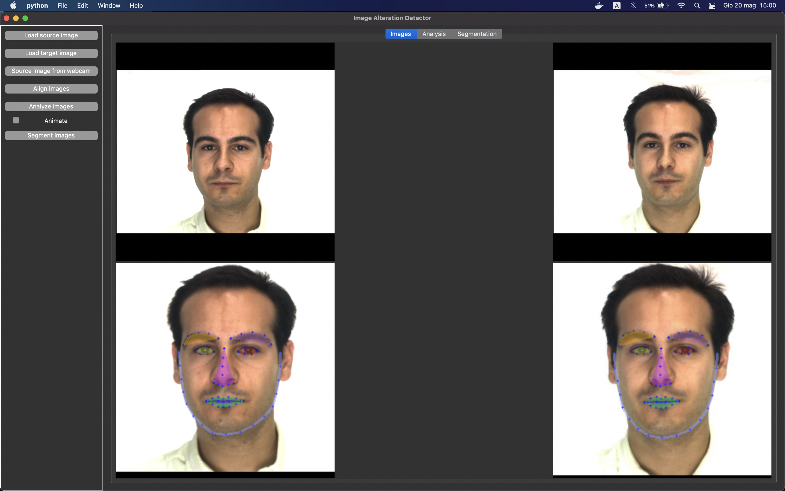

# Image Alterations Detector

## A simple tool for face alteration detection for eMRTD validation

<h1 align="center">
    
</h1>

## Install python with Tkinter

Project needs Tkinter library to work. Python generally comes shipped with an integrated tk package inside.

### Tkinter on Mac Os and pyenv

Pyenv does not install a python version with tkinter package. To install a compatible python version follow
this [guide](https://stackoverflow.com/questions/60469202/unable-to-install-tkinter-with-pyenv-pythons-on-macos).

### Tkinter on Linux (and virtualenv)

```bash
sudo apt-get install python3-tk
```

## Install dependencies

```bash
pip install -r requirements.txt
```

## Run the tool

```bash
pwd: .../image-alterations-detector
python -m image_alterations_detector.main   
```

## Examples

### Align Images



### Perform analysis and alteration detection


### Segment and check IOU values


